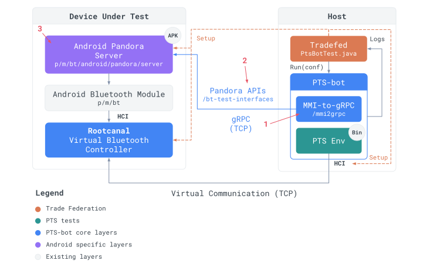

# PTS-bot with Android

This user guide explains how to install, configure, and use PTS-bot on Android.

## Setup

* The standard PTS-bot setup on Android is to test a [Cuttlefish](
  https://source.android.com/docs/setup/create/cuttlefish) virtual Android DUT.

* Pandora APIs are implemented both on Android in a
  [PandoraServer][pandora-server-code] app.

* The communication between the virtual Android DUT and the virtual Bumble
  Reference device is made through [Rootcanal][rootcanal-code], a virtual
  Bluetooth Controller.


## Usage

### Prerequisites

* You must have a running CF instance. If not, you can run the following
  commands from the root of your Android repository:

  ```shell
  source build/envsetup.sh
  lunch aosp_cf_x86_64_phone-trunk_staging-userdebug
  acloud create --local-image --local-instance
  ```

  Note: For Googlers, from an internal Android repository, use the
  `cf_x86_64_phone-userdebug` target instead. You can also use a CF remote
  instance by removing `--local-instance`.

* Install `pts-bot`:

  ```shell
  sudo glinux-add-repo blueberry unstable
  sudo apt update && sudo apt install pts-bot
  ```

* Put PTS official binary in your config path:

  ```shell
  mkdir -p ~/.config/pts
  cp /google/data/ro/teams/pandora/pts_setup_8_0_3.exe ~/.config/pts
  ```

* Install virtual env:

  ```shell
  sudo apt install virtualenv
  ```

### Run a test

You can run a specific PTS-bot test using `atest`:

```shell
atest pts-bot:[YOUR TEST] -v # -v is mandatory to retrieve PTS-bot logs
```

For example:

```shell
atest pts-bot:A2DP/SRC/REL/BV-01-I -v # This test must pass
```

To run all PTS-bot tests:

```shell
atest pts-bot -v
```

Warning: Running all PTS-bot tests can take several hours.

## Build a new PTS-bot test

Follow the instructions below to create your first PTS-bot test.

The implementation of a new PTS-bot test requires to:

1. Implement its required Man Machine Interface (MMI) by calling the right
   Pandora APIs.
1. Define any missing Pandora APIs.
1. Implement any missing Pandora APIs in the Android Pandora server.



### Download and understand PTS test documentation of your profile

* Download the Test Suite (TS) document of the profile you want to test from
  https://www.bluetooth.com/specifications/specs/, located in the *Qualification
  Test Documents* column.
* Download the Abstract Test Suite (ATS) of your profile in the
  [ATS Drive folder][ats-drive].
* For more information about TS and ATS, see [Understand PTS tests](pts-tests).
* Make sure the tests you want ot implement are applicable to Android: they
  should appear in the [list of Android PTS tests][android-pts-tests].

### Find the MMIs you need to implement

* Add your profile to PTS-bot Tradefed configuration if it isn't already here:
  [p/m/Bluetooth/android/pandora/server/configs/PtsBotTest.xml][pts-bot-tf-config].

  It should be added in the `<test>` section. For example:
  `<option name="profile" value="A2DP/SRC"/>`

* Run your test using `atest`:

  ```shell
  atest pts-bot:[YOUR TEST] -v
  ```

* The test fails if some MMIs are missing, and they should be listed at the
  end of `PtsBotTest` logs.

### Implement the missing MMIs

#### 1. Create a MMI-to-gRPC proxy for your profile [if it does not exist]

Create your profile proxy by copy/paste the indications from `PtsBotTest`
runtime error logs.

It should look like the following
`p/m/Bluetooth/android/pandora/mmi2grpc/mmi2grpc/[profile].py`:

```python
from mmi2grpc._helpers import assert_description
from mmi2grpc._proxy import ProfileProxy
from pandora.[profile]_grpc import [PROFILE]


class [PROFILE]Proxy(ProfileProxy):

    def __init__(self, channel):
        super().__init__()
        self.[profile] = PROFILE(channel)

    @assert_description
    def [missing_mmi](self, **kwargs):
        """
        [MMI description]
        """
        # This is where we'll do the translation of the MMI to gRPC calls.
        return "OK"

```

Note: The `@assert_description` asserts if the comment is not identical as
the official PTS mmi description. It is optional and you can remove it if your
description contains variable values.

Warning: The PTS tool expects some of the tests to be run with a specific
physical dongle. `mmi2grpc._rootcanal` adds test bindings to `RootCanal`
to change the configuration of the PTS controller:

```python
from mmi2grpc._rootcanal import Dongle


class [PROFILE]Proxy(ProfileProxy):

    def __init__(self, channel, rootcanal):
        super().__init__()
        self.[profile] = PROFILE(channel)
        self.rootcanal = rootcanal

    def test_started(self, test: str, **kwargs):
        # Supported dongles include:
        #  - DEFAULT (Android controller configuration)
        #  - CSR_RCK_PTS_DONGLE (Dual, HCI 5.0)
        #  - LAIRD_BL654 (LE only, HCI 5.4)
        self.rootcanal.select_pts_dongle(Dongle.LAIRD_BL654)
```

#### 2. Instantiate your profile proxy [if it does not exist]

In
[`p/m/Bluetooth/android/pandora/mmi2grpc/mmi2grpc/__init__.py`][mmi2grpc-init],
add the following:

* Import your profile proxy:
  ```python
  from mmi2grpc.[profile] import [PROFILE]Proxy
  ```
* Set it to `None` in `def __init__` and `def __exit__`:
  ```python
  self._[profile] = None
  ```
* Set it in `def interact`:
  ```python
  if profile in ('[PROFILE]'):
      if not self._[profile]:
          self._[profile] = [PROFILE]Proxy(
              grpc.insecure_channel(f'localhost:{self.port}'))
      return self._[profile].interact(
          test, interaction, description, pts_address)

  ```

#### 3. Create your profile Pandora API [if it does not exist]

Create a `[profile].proto` in
[p/m/Bluetooth/pandora/interfaces/pandora_experimental/][pandora-experimental-api-code]:

```proto
syntax = "proto3";

package pandora;

option java_outer_classname = "[Profile]Proto";

import "google/protobuf/empty.proto";

service [PROFILE] {}
```

#### 4. Define a Pandora API [if it does not exist]

Define the methods necessary to implement the missing MMI in `[profile].proto`:

```proto
syntax = "proto3";

package pandora;

option java_outer_classname = "[Profile]Proto";

import "google/protobuf/empty.proto";

service [PROFILE] {
  rpc [YourNewApi]([Request]) returns ([Response])
}
```

A Pandora API must be generic enough and must not rely on any implementation
specific behavior. You can review the [Pandora API overview](
https://developers.google.com/pandora/guides/bt-test-interfaces/overview) and
[style-guide](
https://developers.google.com/pandora/guides/bt-test-interfaces/style-guide) to
understand the best practices.

A good way to think about the design of a test interface generic is to:

* Look at the MMI message.
* Analyze the test behavior.
* Try to visualize the big picture and avoid any method relying on
  implementation specific behavior (such as the `SetActive` method of A2DP,
  which is really Android specific and does not match any other stack behavior).

#### 5. Implement your Pandora API in the Android Pandora server [if it does not exist]

Create a `[Profile].kt` Kotlin class for your profile into
[`p/m/Bluetooth/android/pandora/server/src/`][pandora-server-src-code] and make
it inherit from `[PROFILE]ImplBase()`. This class should implements your
Pandora API defined earlier and provide it as a service in the Pandora server.

```kt
package com.android.pandora

import android.bluetooth.BluetoothAdapter
import android.bluetooth.BluetoothManager
import android.content.Context
import android.util.Log
import pandora.[PROFILE]Grpc.[PROFILE]ImplBase
import pandora.[Profile]Proto.*
import com.google.protobuf.Empty
import io.grpc.stub.StreamObserver
import kotlinx.coroutines.CoroutineScope
import kotlinx.coroutines.Dispatchers
import kotlinx.coroutines.cancel

@kotlinx.coroutines.ExperimentalCoroutinesApi
class [Profile](val context: Context) : [PROFILE]ImplBase() {
  private val TAG = "Pandora[Profile]"

  private val scope: CoroutineScope

  init {
    // Init the CoroutineScope
    scope = CoroutineScope(Dispatchers.Default)
  }

  fun deinit() {
    // Deinit the CoroutineScope
    scope.cancel()
  }

  /**
   * Your new API description.
   * @param request Request sent by the client.
   * @param responseObserver Response to build and set back to the client.
   */
  override fun yourNewApi(
    request: Empty,
    responseObserver: StreamObserver<Empty>
  ) {
    // TODO
  }
}
```

Instantiate your new profile in [`Server.kt`][pandora-server-server] by adding
it to `services` in `mapOf` using `BluetoothProfile.[PROFILE] to ::[Profile]`.

#### 6. Implement your missing MMI using Pandora APIs

In `p/m/Bluetooth/android/pandora/mmi2grpc/mmi2grpc/[profile].py`:

```python
from mmi2grpc._helpers import assert_description
from mmi2grpc._proxy import ProfileProxy
from pandora.[profile]_grpc import [PROFILE]


class [PROFILE]Proxy(ProfileProxy):

    def __init__(self, channel):
        super().__init__()
        self.[profile] = PROFILE(channel)

    @assert_description
    def [missing_mmi](self, **kwargs):
        """
        [MMI description]
        """
        self.[profile].ExistingApi()
        self.[profile].YourNewApi()
        return "OK"

```

### Run your test

Your test should now pass. Run it using:

```shell
atest pts-bot:[YOUR TEST] -v
```
Congratulations! You just set up a clean PTS-bot environment and implemented
your first PTS-bot test.

[pandora-server-code]: https://cs.android.com/android/platform/superproject/main/+/main:packages/modules/Bluetooth/android/pandora/server/

[pandora-server-src-code]: https://cs.android.com/android/platform/superproject/main/+/main:packages/modules/Bluetooth/android/pandora/server/src/

[pandora-server-server]: https://cs.android.com/android/platform/superproject/main/+/main:packages/modules/Bluetooth/android/pandora/server/src/Server.kt

[rootcanal-code]: https://cs.android.com/android/platform/superproject/main/+/main:packages/modules/Bluetooth/tools/rootcanal

[pandora-experimental-api-code]: https://cs.android.com/android/platform/superproject/+/main:packages/modules/Bluetooth/pandora/interfaces/pandora_experimental/

[ats-drive]: https://drive.google.com/corp/drive/folders/1-7GDkVhA0am5RDvmJaqrh77dBiakvGV2?resourcekey=0-cZ4zBNiNc5CXsEKlczNXRA

[android-pts-tests]: https://docs.google.com/spreadsheets/d/1pTFRItNEGjVR7LHKdgKlrwSwRZ1sBngh/edit?resourcekey=0-7mZ0bzRJX9wvAdpCXEz-ow#gid=1920426446

[pts-bot-tf-config]: https://cs.android.com/android/platform/superproject/main/+/main:packages/modules/Bluetooth/android/pandora/server/configs/PtsBotTest.xml

[mmi2grpc-init]: https://cs.android.com/android/platform/superproject/main/+/main:packages/modules/Bluetooth/android/pandora/mmi2grpc/mmi2grpc/__init__.py
