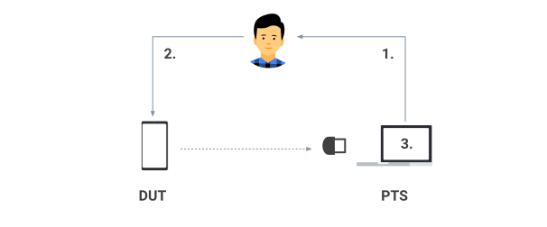
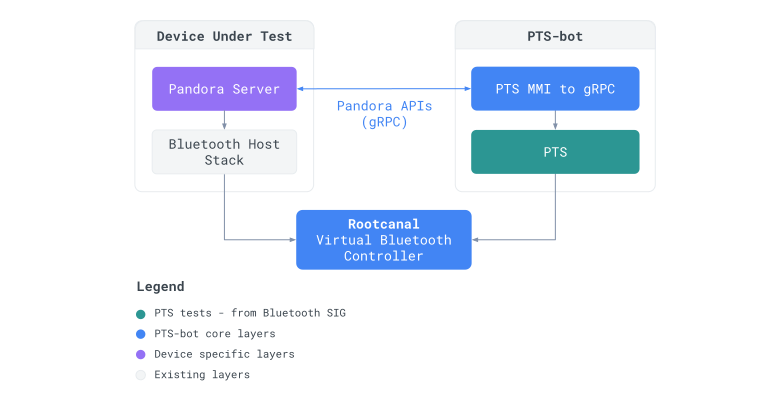

# PTS-bot

**PTS-bot** is an automation of the Bluetooth Profile Tuning Suite (PTS), which
is the official testing tool provided by the Bluetooth standard to run Host
certification tests.

## What is the PTS?

The [Bluetooth Profile Tuning Suite (PTS)](
https://www.bluetooth.com/develop-with-bluetooth/qualification-listing/qualification-test-tools/profile-tuning-suite/)
is a Windows testing software that automates certification testing to the
specified functional requirements of Bluetooth Host Parts (i.e. specifications
that reside above the Host Controller Interface (HCI)).

As stated by the Bluetooth SIG, the vision of the PTS is to provide complete and
validated test coverage, of all specified functional requirements in scope, to
the Bluetooth development and testing community.

A PTS test consists of a series of the following steps:

* Requesting an action to be performed by a human operator (1.) on the DUT
  through a Man Machine Interface (MMI), who executes it (2.).

* Verifying by the PTS software that the action has been correctly executed
  (3.).

## Architecture

PTS-bot fixes the major limitations of the PTS:

* **It runs the official PTS binary in [Wine](https://www.winehq.org/)**, a
  compatibility layer allowing to run Windows applications on POSIX OS such as
  Linux.

* **It emulates the Bluetooth communication between the PTS and the DUT using
  Rootcanal**, a virtual Bluetooth Controller, removing the need for a physical
  dongle.

* **It automates commands to the DUT through the Pandora Bluetooth test
  interfaces** (see below). A translation layer is built to convert the actions
  on the DUT requested by the PTS through its Man Machine Interfaces (MMIs) to
  gRPC, removing the need for a human operator.

PTS-bot is relying on 3 key components:

* [Pandora APIs](https://github.com/google/bt-test-interfaces): They provide a
  common abstraction for Avatar to interact with all Bluetooth implementations,
  exposing all standard Bluetooth capabilities over [gRPC](https://grpc.io/).

* **libpts** manages the PTS
  environment, including the Wine server for running the PTS Windows binary and
  the PTS parser, used to produce well structured logs and to parse the PTS MMI.
  This library is mostly written in Rust.

* **mmi2grpc** acts as a gRPC client (the gRPC server being
  implemented on the DUT) and translates PTS MMIs into gRPC calls. This library
  is written in python so as to be easier to update by other developers.

* [Rootcanal](https://github.com/google/rootcanal): A virtual Bluetooth
  Controller which emulates the Bluetooth communication between the devices
  being tested. It is notably integrated in Cuttlefish (CF),
  an Android virtual device.

## Goals

* **It provides a huge number of tests, without the need to implement the
  entire test framework**, and can act as the first testing quality bar.

* **It allows pre-certifying DUTs** using a virtual Bluetooth communication
  without all the issues that the PTS usually have when running physically,
  allowing it to be run in a fast and repeatable fashion. It can also enable
  automation of the physical PTS tests.

PTS-bot aims to be used by Bluetooth stack developers, locally on their machines
and within presubmit tests, to verify that their code is passing the minimum
Bluetooth test requirements to avoid introducing regressions.

## Limitations

PTS-bot has two main limitations:

* Because it relies on the PTS binary for providing tests, it is limited to the
  same test coverage, and cannot be extended by custom tests. This means that
  passing PTS-bot tests is necessary but not sufficient (as some
  interoperability issues are not covered by the PTS).

* Because it relies on a virtual Bluetooth Controller, it cannot check for any
  potential issues located inside the Bluetooth chip of a specific device.
