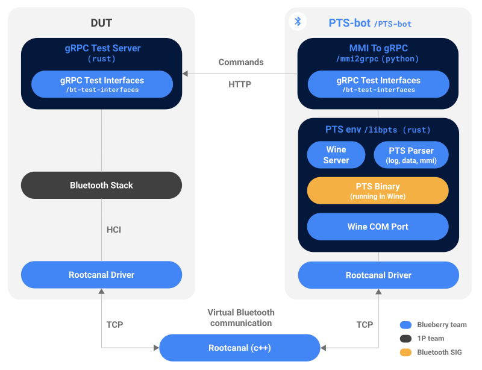

Project: /blueberry/_project.yaml
Book: /blueberry/_book.yaml

# PTS-bot

**PTS-bot** is a standalone tool that automates the PTS provided by the
Bluetooth SIG in [Wine](https://www.winehq.org/), providing all the PTS
certification tests to Blueberry.

## What is the PTS?

The [Bluetooth Profile Tuning Suite (PTS)](
https://www.bluetooth.com/develop-with-bluetooth/qualification-listing/qualification-test-tools/profile-tuning-suite/)
is a Windows testing software that automates certification testing to the
specified functional requirements of Bluetooth Host Parts (i.e. specifications
that reside above the Host Controller Interface (HCI)).

As stated by the Bluetooth SIG, the vision of the PTS is to provide complete and
validated test coverage, of all specified functional requirements in scope, to
the Bluetooth  development and testing community.

However, the PTS currently has three major limitations, which makes it
impossible to automate and hard to use:

* It only runs on Windows.

* It requires a Bluetooth USB dongle to work, and thus relies on a physical
  communication to the DUT, often requiring to rerun tests due to a poor
  reliability.

* It requires a human operator (notably by using popups for manual actions).

## Introducing PTS-bot

PTS-bot fixes the three major limitations of the PTS:

* **It runs the official PTS binary in [Wine](https://www.winehq.org/)**, a
  compatibility layer allowing to run Windows applications on POSIX OS such as
  Linux.

* **It emulates the Bluetooth communication between the PTS and the DUT using
  Rootcanal**, a virtual Bluetooth Controller built for AOSP, removing the need
  for a physical communication. HCI calls on the DUT are routed to Rootcanal
  instead of the Bluetooth chipset.

* **It automates commands to the DUT through Bluetooth test interfaces (gRPC)**
  exposed by each layer of the Bluetooth stack. A translation layer is built to
  convert the PTS Man Machine Interface (MMI) to gRPC, removing the need for a
  human operator.

### Goals

PTS-bot has been built as an important first piece of Blueberry:

* **It provides a huge number of tests, without the need to implement the
  entire test framework**, which addresses the urgency of having tests for
  Google Bluetooth stacks.

* **It will allow defining and unifying all Bluetooth test interfaces of
  Blueberry**, both low-level and high-level (as PTS tests cover both). Other
  types of Blueberry tests (device-to-device or interoperability) will then use
  the same interfaces.

* **It will allow pre-certifying DUTs** using a virtual Bluetooth communication
  without all the issues that the PTS usually have when running physically,
  allowing it to be run in a fast and repateable fashion. It can also enable
  automations of the physical PTS tests.

PTS-bot aims to be used by Bluetooth stack developers, locally on their machines
and within pre-submit tests, to verify that their code is passing the minimum
Bluetooth test requirements to avoid introducing regressions.

### Architecture

PTS-bot is made of three components:

* [`libpts`](https://blueberry.git.corp.google.com/libpts/) manages the PTS
  environement, including the Wine server for running the PTS Windows binary and
  the PTS parser, used to produce well structured logs and to parse the PTS MMI.
  This library is mostly written in Rust.

* **Rootcanal** as a virtual Bluetooth Controller, with which the device under
  test must be compatible.

* [`mmi2grpc`](https://blueberry.git.corp.google.com/mmi2grpc/) translates
  PTS inputs into gRPC calls. This library is written in python so as to be
  easily updated by other developers.

PTS-bot interacts with the Bluetooth gRPC test interfaces which are located in
the [`bt-test-interfaces`](
https://blueberry.git.corp.google.com/bt-test-interfaces/) repository. Those
interfaces are not solely designed for PTS-bot but aim to be used for all tests
interacting with a Google Bluetooth stack (for both Android and embedded
devices).

PTS-bot can run on the same device as the Bluetooth stack to be tested (for
instance both being run on the same Linux computer, or within the same Android
virtual device) or on two separate devices (Rootcanal communication is done
through TCP).

### Limitations

PTS-bot has two limitations:

* Because it relies on the PTS binary for providing tests, it is limited to the
  same test coverage, and cannot be extended by custom tests. This means that
  passing PTS-bot tests is necessary but not sufficient (as some
  interoperability issues are not covered by the PTS).

* Because it relies on a virtual Bluetooth Controller, it cannot check for any
  potential issues located inside the Bluetooth chipset of a specific device.
  This means again that PTS-bot must be supplemented by physical tests.
